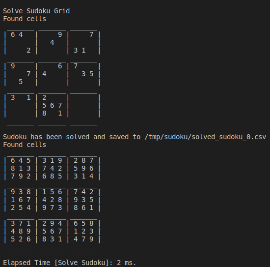

# Sudoku Solving

Although the backtracking approach to solve a sudoku is already fast enough, I found fun and challenging to implement a solver by using standard sudoku techniques.
However, when the sudoku grid gets too hard, there's no guarantee that the implemented techniques are able to solve entirely the problem. The algorithm might be stuck in a configuration
that requires to use more advanced techniques, which won't necessarily be enough to solve the problem but can turn out to be very time-consuming.

As a consequence, I decided to propagate constraints as much as possible through the grid using standard techniques and to complete the last missing cells using backtracking.
This solution is about 3 times faster than the backtracking approach. We notice that the backtracking method is extremely effective given that it's implemented is less than 100 lines of code.


## 1 - Installation

First, clone the repository.
```
git clone https://github.com/ThomasParistech/sudoku.git
```
Then, go to the directory and compile it.
```
cd sudoku
mkdir build
cd build
cmake ..
make -j6
```
Please note that CMakeLists.txt is configured in a such way that the executable is generated in the "bin" directory.

## 2 - Running

Go to the build directory and launch the main app. Example:
```
bin/main -i ../sudoku_grids/sudoku_expert.csv
```
Check the help for additional information
```
bin/main -h
```



## 3 - Algorithm

We construct a 9x9 grid of cells, which contain sets of candidates inside [1, 9]. There's also rows, columns and squares that store bitsets.
The idea is to incrementally set the cells from the initialisation grid and propagate the constraint through the grid.
Once a cell is reduced to one possibility, we can set it.

Basic conditions to set a value in a cell are
- A cell has only one possibility
- A line has only one possibility
- A square has only one possibility

When we set the value inside a cell, the more obvious way to propagate this constraint is to indicate to the corresponding row, column and square that this value
is no longer available. But there's also smarter ways to take benefit from this constraint.
- Let's split a row in 3 sub-parts. If a digit is available only in one of the three sub-parts, then the square containing this sub-part can't have this value at another location. thus we can remove
this possibility from the 6 other cells in the square. We get a similar result for the columns and the squares.
- If we detect a "fish" pattern (Xwing, Swordfish, JellyFish ...), we can then lock a certain number of rows or columns.
- By spreading coloring paths, we can confirm a digit in a cell

